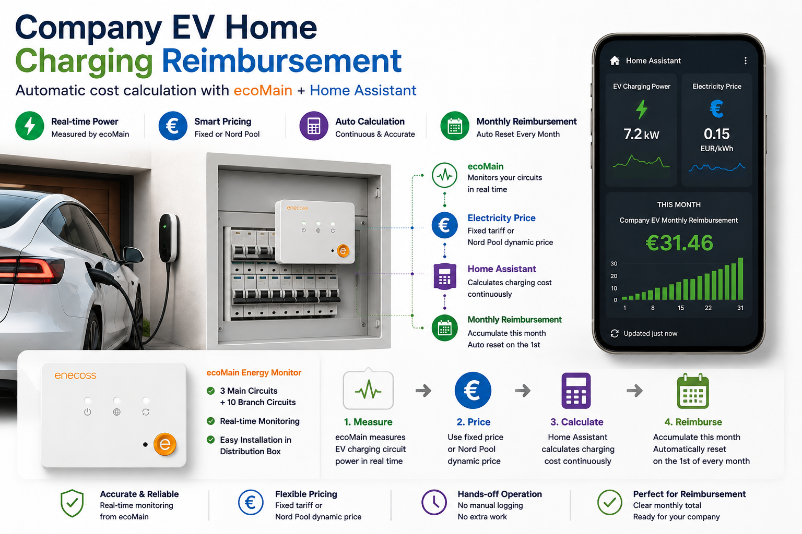
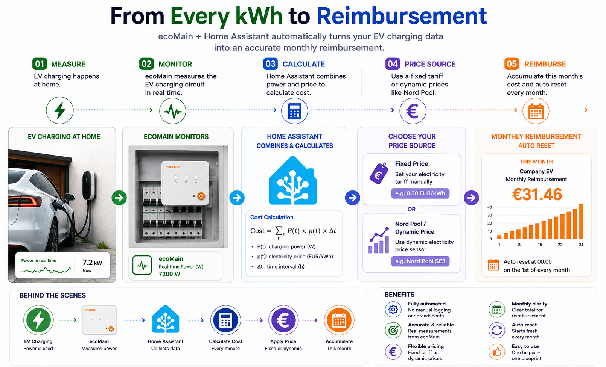
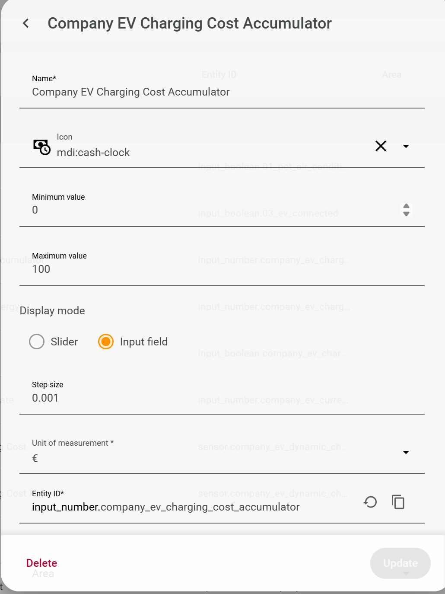
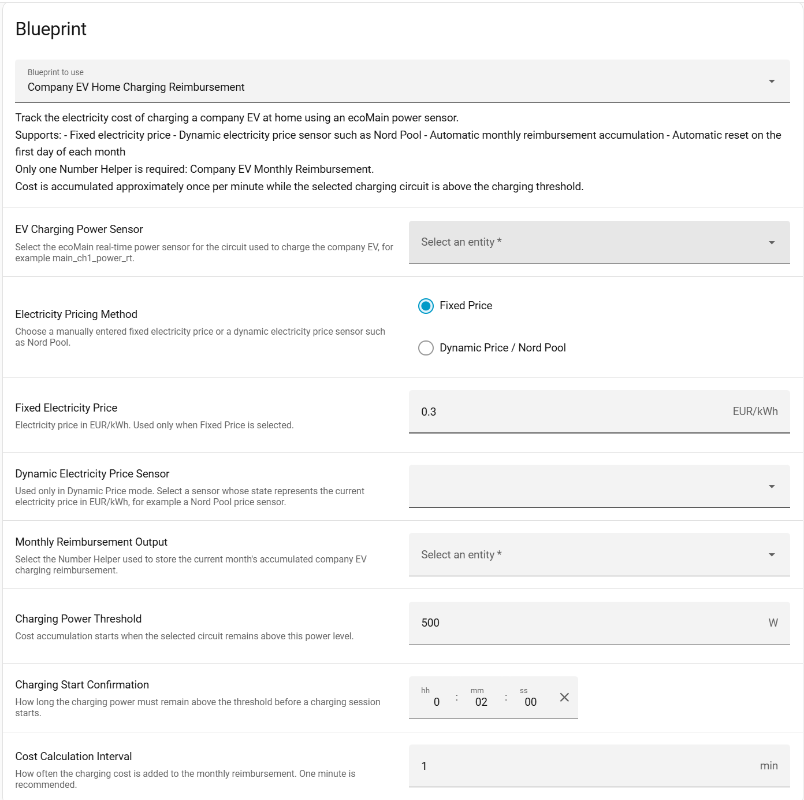
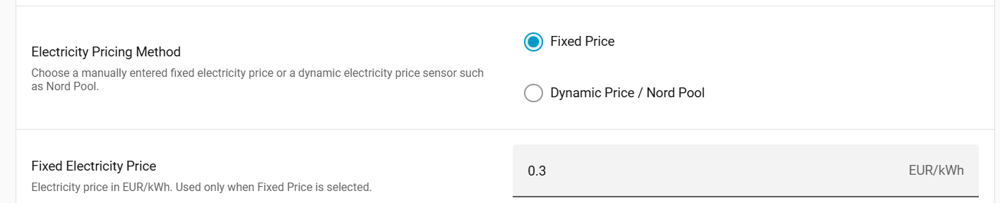
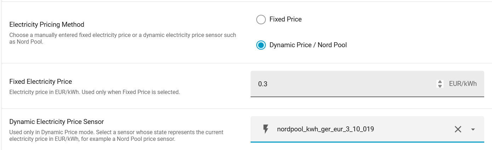
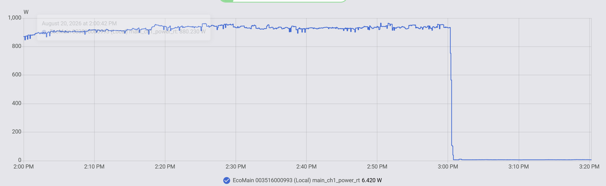
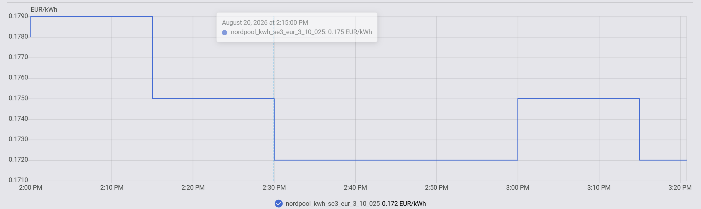
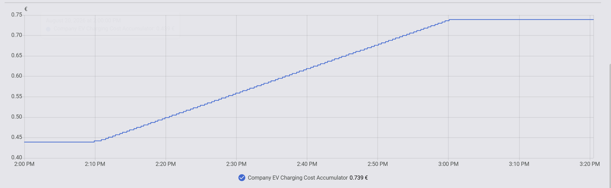

# 🚗 Company EV Home Charging Reimbursement

> Automatically calculate the monthly cost of charging a **company EV at home** using **ecoMain + Home Assistant**, with either a **fixed electricity tariff** or **dynamic electricity prices such as Nord Pool**.

<p align="center">
  
</p>

<p align="center">
  <b>⚡ Measure &nbsp;→&nbsp; 💶 Calculate &nbsp;→&nbsp; 📅 Reimburse</b>
</p>

---

## 💡 The Idea

Charging a company EV at home creates a simple question:

> **How much of the household electricity bill should be reimbursed by the company?**

With ecoMain monitoring the EV charging circuit, Home Assistant can automatically calculate the charging cost and keep a running total for the current month.

The user only needs to:

1. Select the **ecoMain channel** monitoring the EV charging circuit.
2. Choose a **fixed electricity price** or a **dynamic price sensor** such as Nord Pool.
3. Select one Number Helper to store the monthly reimbursement.

After that, the Blueprint handles the calculation automatically.

---

## 🔄 How It Works

<p align="center">
  
</p>

When EV charging is detected, the Blueprint periodically calculates:

\[
\Delta C = P_{\mathrm{EV}} \times p_{\mathrm{electricity}} \times \Delta t
\]

where:

- \(P_{\mathrm{EV}}\) = measured EV charging power in kW
- \(p_{\mathrm{electricity}}\) = electricity price in EUR/kWh
- \(\Delta t\) = calculation interval in hours

Each cost increment is added to the current month's reimbursement.

---

# 🚀 Setup

Only **one Helper + one Blueprint** are required.

---

## ① Create One Number Helper

Go to:

**Settings → Devices & services → Helpers → Create helper → Number**

Create the following Helper:

| Setting | Value |
|---|---|
| **Name** | `Company EV Monthly Reimbursement` |
| **Minimum value** | `0` |
| **Maximum value** | `10000` |
| **Step size** | `0.001` |
| **Unit of measurement** | `EUR` |
| **Display mode** | Input field |

<p align="center">
  
</p>

> [!TIP]
> This is the **only Helper required** by the example.

The Helper stores the accumulated charging reimbursement for the current month.

---

## ② Import the Blueprint

Import the **Company EV Home Charging Reimbursement** Blueprint into Home Assistant.

<!-- Replace YOUR_GITHUB_BLUEPRINT_URL with the final raw GitHub URL -->

[](https://my.home-assistant.io/redirect/blueprint_import/?blueprint_url=YOUR_GITHUB_BLUEPRINT_URL)

Then create a new automation from the imported Blueprint.

The Blueprint handles:

- EV charging detection
- fixed or dynamic electricity pricing
- periodic charging-cost calculation
- monthly reimbursement accumulation
- automatic monthly reset

No additional charging-status, start-energy, price-interval, or cost-accumulator Helpers are required.

---

## ③ Configure the Blueprint

The main Blueprint configuration is intentionally simple.

<p align="center">
  
</p>

### EV Charging Power Sensor

Select the ecoMain real-time power sensor connected to the EV charging circuit.

For example:

```text
EcoMain ... main_ch1_power_rt
```

or an entity similar to:

```text
sensor.ecomain_xxxxxxxxxxxx_local_main_ch1_power_rt
```

> [!NOTE]
> The exact entity ID depends on the ecoMain installation and the channel used for the EV charger.

---

### Monthly Reimbursement Output

Select:

```text
Company EV Monthly Reimbursement
```

This is the Number Helper created in Step ①.

---

# 💶 Choose Your Electricity Price

The Blueprint supports two pricing methods.

| 💶 Fixed Price | ⚡ Dynamic Price |
|:---:|:---:|
| Enter the electricity tariff manually | Select a dynamic price sensor |
| `0.30 EUR/kWh` | e.g. Nord Pool |
| Simple and widely applicable | Automatically follows price changes |
| Best for fixed household tariffs | Best for hourly/dynamic tariffs |

---

## Option A — Fixed Electricity Price

Select:

```text
Electricity Pricing Method:
Fixed Price
```

Then enter the household electricity price.

For example:

```text
0.30 EUR/kWh
```

<p align="center">
  
</p>

For a fixed tariff, the charging cost is calculated from:

\[
C \approx \sum_t P_{\mathrm{EV}}(t)\,p_{\mathrm{fixed}}\,\Delta t
\]

### Example

If the EV is charging at:

```text
Power = 7.2 kW
Price = 0.30 EUR/kWh
```

the current charging cost rate is approximately:

\[
7.2 \times 0.30 = 2.16\ \mathrm{EUR/h}
\]

With a one-minute calculation interval:

\[
\Delta C
=
2.16\times\frac{1}{60}
=
0.036\ \mathrm{EUR}
\]

The Blueprint adds this cost to the monthly reimbursement automatically.

---

## Option B — Dynamic Price / Nord Pool

If a dynamic electricity-price integration is available, select:

```text
Electricity Pricing Method:
Dynamic Price / Nord Pool
```

Then select the corresponding electricity-price sensor.

For example:

```text
sensor.nordpool_...
```

<p align="center">
  
</p>

The Blueprint reads the current electricity price automatically:

\[
C
\approx
\sum_t
P_{\mathrm{EV}}(t)
\,
p_{\mathrm{dynamic}}(t)
\,
\Delta t
\]

This means the charging cost automatically follows electricity-price changes.

### Example

An overnight charging session might look like:

| Time | Charging Power | Electricity Price |
|---|---:|---:|
| 22:00 | 7.2 kW | 0.12 EUR/kWh |
| 23:00 | 7.2 kW | 0.08 EUR/kWh |
| 00:00 | 7.2 kW | 0.05 EUR/kWh |
| 01:00 | 7.2 kW | 0.07 EUR/kWh |

Instead of applying one electricity price to the entire charging session, Home Assistant uses the current price during each calculation interval.

> [!TIP]
> Dynamic pricing is optional. Users without Nord Pool or another dynamic-price integration can simply use **Fixed Price**.

---

# ⚡ Charging Detection

The Blueprint uses ecoMain's real-time power measurement to determine when charging starts.

Default settings:

| Parameter | Default |
|---|---:|
| **Charging Power Threshold** | `500 W` |
| **Charging Start Confirmation** | `2 min` |
| **Cost Calculation Interval** | `1 min` |

The charging session starts when:

```text
EV circuit power > 500 W
        │
        │ continuously for 2 minutes
        ▼
Charging detected
        │
        ▼
Start accumulating cost
```

The confirmation delay helps prevent short power spikes from being interpreted as EV charging.

---

## 📈 Real-World Test: Dynamic Nord Pool Pricing

To verify the automation under real operating conditions, the system was tested using an actual ecoMain circuit together with a live Nord Pool electricity price sensor.

During the test, three values were recorded simultaneously:

1. **Real-time charging power from ecoMain**
2. **Live Nord Pool electricity price**
3. **Accumulated EV charging cost**

### ⚡ Charging Power



ecoMain continuously measured the selected charging circuit at approximately **0.9 kW** during the test.

At around 15:00, the load dropped to nearly zero, indicating that charging had stopped.

---

### 💶 Dynamic Nord Pool Price



The electricity price was not fixed during the charging session.

The Nord Pool sensor automatically supplied the current electricity price to Home Assistant, including several price changes during the test.

No manual tariff update was required.

---

### 📊 Accumulated Charging Cost



While the EV was charging, the reimbursement cost increased continuously according to the actual electricity price at that moment.

Conceptually:

$$
C = \int P(t)\,p(t)\,dt
$$

where:

- $P(t)$ = real-time charging power
- $p(t)$ = electricity price at that moment
- $C$ = accumulated charging cost

In this test, the accumulated cost increased from approximately **€0.439** to **€0.739**.

When charging stopped and the measured power dropped to nearly zero, the accumulated cost stopped increasing automatically.

### ✅ What This Test Demonstrates

The system does not assume one fixed electricity price for the entire charging session.

Instead, it follows the actual electricity price over time:

**ecoMain power measurement → Nord Pool price → real-time cost integration → monthly reimbursement**

This makes the same Blueprint suitable for both:

- **Fixed electricity tariffs**
- **Dynamic electricity pricing such as Nord Pool**

# 📅 Monthly Reimbursement

The final result is intentionally simple:

<p align="center">
  
</p>

<p align="center">
  <strong style="font-size: 24px;">THIS MONTH</strong>
</p>

<p align="center">
  <strong>Company EV Monthly Reimbursement</strong><br>
  <strong>€31.46</strong>
</p>

The value represents the accumulated company-EV home-charging cost for the current month.

Every time charging is detected:

```text
€12.41
   ↓
€12.45
   ↓
€12.49
   ↓
   ...
   ↓
€31.46
```

The employee can then use the monthly value as a reference when submitting the charging cost for reimbursement.

---

## 🔄 Automatic Monthly Reset

At:

```text
00:00 on the first day of each month
```

the Blueprint automatically resets:

```text
Company EV Monthly Reimbursement
```

to:

```text
€0.00
```

For example:

```text
┌──────────────────────────────┐
│        AUGUST 31             │
│                              │
│  Monthly Reimbursement       │
│          €31.46              │
└──────────────┬───────────────┘
               │
               │  September 1
               │  00:00
               ▼
┌──────────────────────────────┐
│       SEPTEMBER 1            │
│                              │
│  Monthly Reimbursement       │
│           €0.00              │
└──────────────────────────────┘
```

A new monthly reimbursement period then begins automatically.

---

# 🏠 Example Dashboard

A simple Home Assistant dashboard can display the most useful information:

<p align="center">
  
</p>

Suggested entities:

| Dashboard Item | Purpose |
|---|---|
| ⚡ **EV Charging Power** | Current ecoMain charging-circuit power |
| 💶 **Electricity Price** | Current fixed or dynamic electricity price |
| 📅 **Monthly Reimbursement** | Current month's company EV charging cost |

The main result remains:

> ### **This Month: €XX.XX**

No manual charging log or spreadsheet is required.

---

# 🧩 Example Configuration

A typical ecoMain + Nord Pool setup might look like:

| Blueprint Setting | Example |
|---|---|
| **EV Charging Power Sensor** | ecoMain CH1 `power_rt` |
| **Electricity Pricing Method** | Dynamic Price / Nord Pool |
| **Dynamic Price Sensor** | Nord Pool SE3 |
| **Monthly Reimbursement Output** | Company EV Monthly Reimbursement |
| **Charging Power Threshold** | 500 W |
| **Charging Start Confirmation** | 2 min |
| **Cost Calculation Interval** | 1 min |

For a fixed-price household:

| Blueprint Setting | Example |
|---|---|
| **Electricity Pricing Method** | Fixed Price |
| **Fixed Electricity Price** | 0.30 EUR/kWh |

Everything else works the same way.

---

# 📊 System Overview

| Component | Function |
|---|---|
| **ecoMain** | Measures the EV charging circuit in real time |
| **Home Assistant** | Runs the reimbursement automation |
| **Fixed Price** | Allows manual electricity-price input |
| **Nord Pool / Dynamic Price Sensor** | Provides changing electricity prices |
| **Blueprint** | Calculates and accumulates charging cost |
| **Number Helper** | Stores the current monthly reimbursement |

---

# ✨ Why This Example?

Without automation:

```text
Check charging time
      ↓
Check electricity consumption
      ↓
Look up electricity prices
      ↓
Calculate charging cost
      ↓
Record it somewhere
      ↓
Repeat for every charging session
```

With ecoMain + Home Assistant:

```text
Plug in the company EV
          ↓
       Charge
          ↓
          ↓
          ↓
Check monthly reimbursement
          ↓
       €XX.XX
```

The measurement and cost calculation happen automatically in the background.

---

# ⚠️ Notes

> [!IMPORTANT]
> This example is intended for **monitoring and reimbursement estimation**. Requirements for official billing, fiscal reimbursement, or legally regulated electricity metering may differ depending on the country, employer, electricity provider, and applicable regulations.

- The selected ecoMain channel should correspond to the circuit used for EV charging.
- Dynamic-price sensors should provide a price per kWh compatible with the reimbursement currency.
- The default calculation interval is one minute.
- Charging cost is estimated from sampled real-time power and electricity price.
- Shorter calculation intervals can improve the approximation when charging power changes frequently.
- If Home Assistant is unavailable during part of a charging session, that period may not be included in the calculated reimbursement.

---

# ✅ What You Need

| | Requirement |
|---|---|
| ⚡ | **ecoMain** monitoring the EV charging circuit |
| 🏠 | **Home Assistant** |
| 💶 | **Fixed electricity tariff** or dynamic-price sensor |
| 🔢 | **1 Number Helper** |
| 🤖 | **1 Blueprint** |

That's it.

---

## 🚗 Final Workflow

```text
Company EV
     ↓
Charge at Home
     ↓
ecoMain measures power
     ↓
Home Assistant reads electricity price
     ↓
Blueprint calculates charging cost
     ↓
Monthly reimbursement accumulates
     ↓
             €XX.XX
     ↓
Submit for reimbursement
```

---

<p align="center">
  <b>ecoMain × Home Assistant</b><br>
  Simple monitoring for smarter home energy use.
</p>
